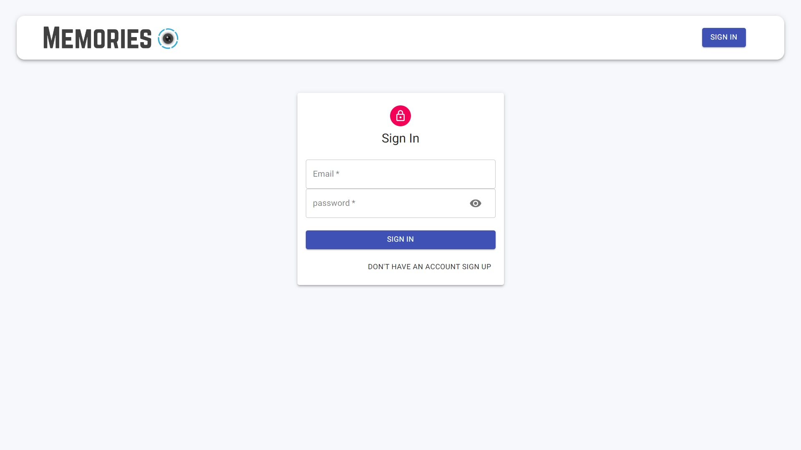

<h1 align="center">Memories Blog Fullstack MERN web app</h1>

<p align="center">
</p>

<h2 align="center"><a href="https://famous-nasturtium-884aa6.netlify.app">👆 Clike here for live demo 💻</a></h2>

---

## Description

**Memories Blog Fullstack MERN Web App**

<p align="center">
</p>

<h3 align="center">Keeper Web App Desktop View - a live demo</h3>

<p>This web app is created using Reactjs in frontend side and Nodejs and Expressjs in backend side. <br> Backend are connected using MongoDb Atlas Cloud database for user and blog posts data storage. <br> Frontend and Backend are connected using REST API's<br>
This web application is a complete example of Fullstack MERN (MongoDb, ExpressJs, ReactJs and NodeJs) web app. <br> This application uses all CRUD (CREATE, READ, UPDATE and DELETE) operations.<br>
This application can be used for Memories sharing between friends and family.
</p>

---

## Technologies used
### Frontend Technolgois
- ReactJs
- Redux
- Axios
- React-Roter
- Material UI

### BAckend Technologies
- NodeJs
- ExpressJs
- Mongoose
- MongoDb Atlas cloud storage

---

## Features
 
<p align="center">
User signup</p>

<p align="center">
User signin</p>

<p align="center">
</p>
<p align="center">Create Post</p>

<p align="center">
Read Post</p>


<p align="center">
</p>
<p align="center">Like post, Edit post, Delete post</p>

<p align="center">
</p>
<p align="center">commnet on post</p>

<p align="center">
</p>
<p align="center">Serch post by title, tags, and creator</p> 

<p align="center">
Post recommendation</p>


<p align="center">
Search results by creator</p>

<p align="center">
Search results by tags</p>


---

## Web App Installation Instructions

- Clone memories blog web app

- Go to project directory

```
git clone https://github.com/abhisheksharma1310/memories_blog.git
cd memories_blog/
```
- Install all packages for client and server

- Run webapp

```
npm install
npm run start
```

- For build package

```
npm run build
```


